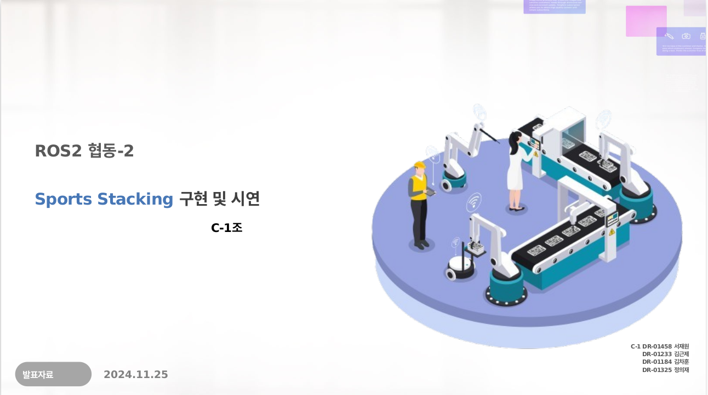

# 3주차: ROS2 기반 협동 로봇 Sport Stacking 시스템

본 프로젝트는 **ROS2를 활용한 협동 로봇을 이용하여 Sport Stacking을 구현**하는 것을 목표로 합니다.

## 발표 자료  
[](docs/발표자료.pdf)

## 📌 프로젝트 개요
- **프로젝트명**: ROS2 기반 협동 로봇 Sport Stacking 시스템
- **발표일**: 2024.11.25
- **팀명**: C-1조
- **팀원**: 서재원, 김근제, 김차훈, 정의재

## 🎯 프로젝트 목표
- 로봇 팔을 활용한 Sport Stacking 구현
- ROS2를 활용한 자동화 시스템 구축
- 정확한 위치 제어 및 힘 제어 기술 적용

## ⚙️ 시스템 개요
### ✅ 주요 기능
- 로봇 팔을 이용한 Sport Stacking 동작 구현
- 투상도(Projection) 기반 시스템 시각화
- ROS2 활용하여 로봇의 다양한 동작 제어

### 📊 사용한 ROS2 함수
| No. | 함수명 | 기능 |
|----|---------|--------------------------------------------------|
| 1  | `set_tool` | 로봇에 장착된 툴을 설정 |
| 2  | `set_tcp` | TCP (Tool Center Point) 설정 |
| 3  | `release_compliance_ctrl` | 힘 제어(Compliance Control) 해제 |
| 4  | `check_force_condition` | 로봇이 설정된 힘 조건을 만족하는지 확인 |
| 5  | `task_compliance_ctrl` | 작업의 힘 제어 모드 설정 |
| 6  | `set_desired_force` | 원하는 힘 값 설정 |
| 7  | `movej` | 조인트 공간에서 로봇 이동 |
| 8  | `movel` | 선형 이동 (linear movement) 수행 |
| 9  | `get_current_posx` | 로봇의 현재 X 좌표 획득 |
| 10 | `trans_1d` | 좌표 변환 수행 |
| 11 | `fkin` | 전방 기구학(Forward Kinematics) 계산 (posj to posx) |
| 12 | `ikin` | 역기구학(Inverse Kinematics) 계산 (posx to posj) |

## 🏗️ 프로젝트 시나리오
### 1️⃣ 초기 시나리오
- 로봇 팔을 이용한 Sport Stacking 초기 동작 설계
- 예상 문제점 파악 및 개선점 도출

### 2️⃣ 최종 시나리오
- Sport Stacking 동작을 위한 최적화된 로봇 알고리즘 적용
- 로봇이 컵을 뒤집고 이동하는 **upside_down, move_space** 동작 구현

## 🔥 프로젝트 결과
### 📌 주요 코드 리뷰
#### 🏗️ 동작 구현 코드 (Code Review 1)
- 컵을 뒤집고 움직이는 컨트롤러
- 잡기 → 뒤집기 → 내려놓기 → 이동 동작 순으로 실행

#### 🏗️ 위치 좌표 설정 코드 (Code Review 2)
- 피라미드 쌓는 위치(pos) 설정
- `data`를 통해 **절대 위치 지정** 및 **좌표 변환 수행**

#### 🏗️ 컵 쌓기 알고리즘 (Code Review 3)
- **stacking** 동작 수행
- **pymidSpace**를 통해 받은 좌표와 **stacked_pos**를 이용해 컵을 이동 및 적재

### 🏆 실습 결과물
<table>
  <tr>
    <td align="center">
      
      <br><b>height Estimation using force control</b></br>
    </td>
    <td align="center">
      
      <br><b>Upside down top cup</b></br>
    </td>
  </tr>
</table>

[Full 비디오 다운로드](https://github.com/sepengsu/rokey_week3_ws//raw/main/docs/final.mp4)

## 🚀 설치 및 실행 방법
1. 프로젝트를 클론합니다.
   ```bash
   git clone https://github.com/your-repository/your-project.git
   cd your-project
   ```

2. colcon build 실행합니다. 
   ```bash
   colcon build 
   ```
3. 실행 스크립트를 실행합니다.
   ```bash
   ./run_project.sh
