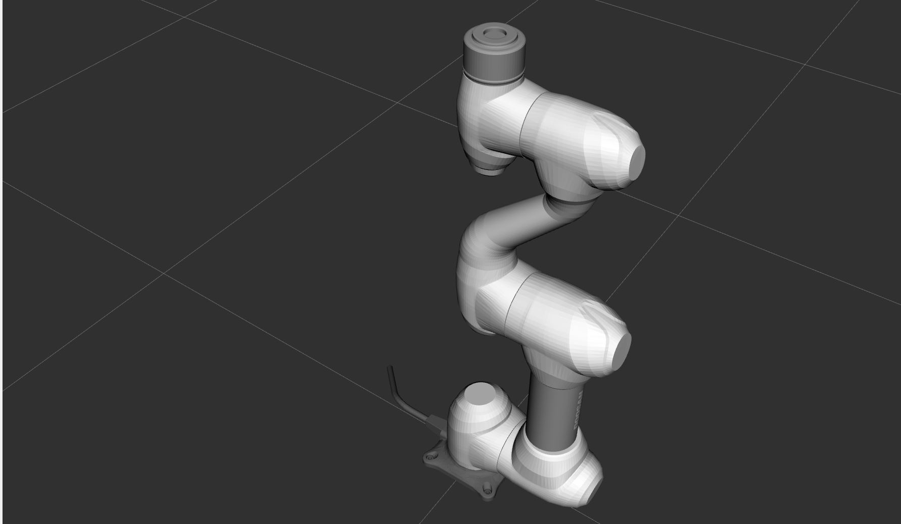

### 3주차 프로젝트 
패키지 출처 
두산 로보틱스: https://github.com/doosan-robotics/doosan-robot2 error가 있음  
강사 : https://github.com/Juwan-s/doosan-robot2
    
#### 설치 가이드 
필요 패키지 설치 
```
### Prerequisite installation elements before package installation
sudo apt-get update
sudo apt-get install -y libpoco-dev libyaml-cpp-dev wget
sudo apt-get install -y ros-humble-control-msgs ros-humble-realtime-tools ros-humble-xacro ros-humble-joint-state-publisher-gui ros-humble-ros2-control ros-humble-ros2-controllers ros-humble-gazebo-msgs ros-humble-moveit-msgs dbus-x11 ros-humble-moveit-configs-utils ros-humble-moveit-ros-move-group

### install gazebo sim
sudo sh -c 'echo "deb http://packages.osrfoundation.org/gazebo/ubuntu-stable `lsb_release -cs` main" > /etc/apt/sources.list.d/gazebo-stable.list'
wget http://packages.osrfoundation.org/gazebo.key -O - | sudo apt-key add -
sudo apt-get update
sudo apt-get install -y libignition-gazebo6-dev
sudo apt-get install -y ros-humble-gazebo-ros-pkgs ros-humble-moveit-msgs ros-humble-ros-gz-sim ros-humble-ros-gz
```

필수적인 패키지 clone 
```
cd src  
https://github.com/Juwan-s/doosan-robot2
git clone -b humble https://github.com/ros-controls/gz_ros2_control

rosdep install -r --from-paths . --ignore-src --rosdistro $ROS_DISTRO -y
cd ~/rokey_week3_ws
colcon build
```
installFile에서 01_Install_docker 설치 


### 2. 연습 실행
ros2 launch dsr_bringup2 dsr_bringup2_rviz.launch.py mode:=virtual host:=127.0.0.1 port:=12345 model:=m0609  

```
export PYTHONPATH=$PYTHONPATH:~/rokey_week3_ws/install/common2/lib/common2/imp 
```
RSR 모드 실행을 위해 꼭 필요

```
ros2 run rokey simple_move
```

### 꿀팁 
https://github1s.com/  
github에서 이걸로 바뀌면 vscode 형식으로 볼 수 있음 

```
ros2 service list | grep AAA  
```
이 코드는 특정 서비스의 리스트들을 확인해주는 방법 
```
ros2 service type AAA
```
이 코드는 특정 서비스의 타입들을 확인하여 어떤 것들로 call할지 확인한다.

```
ros2 service call AAA BBB "{}"
```
이거로 call하면 됨 

### Rokey ros2 함수 살펴보기 

1. install/common2/lib/common2/imp 안에 있는 파일들에서 drl와 비슷한 코드가 많음 
2. DSR_ROBOT2에서 함수를 찾을 수 있다. 명령어 (ex: get_current_posj 등)
3. 